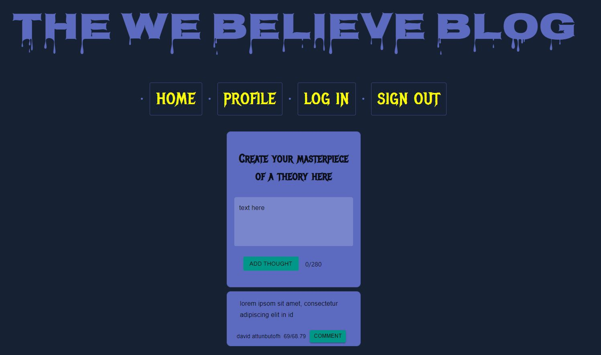
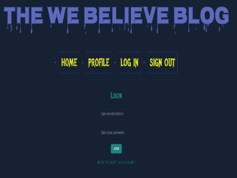
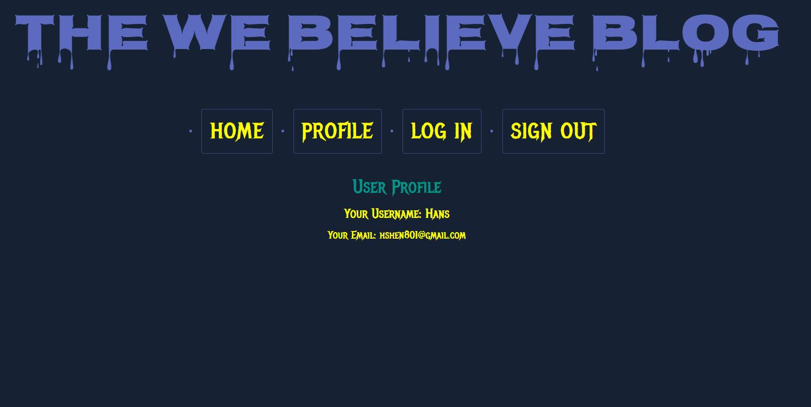

# **[The We Believe Blog](https://we-believe.up.railway.app/)**

A forum for a loving community of weirdos

## Table of Contents

---

- [License](#license)
- [Installation](#installation)
- [Packages](#packages)
- [Description](#description)
- [Usage](#usage)
- [Contributing](#contributing)
- [Tests](#tests)
- [Questions](#questions)

 

## License

---

[MIT License](./LICENSE)  

Copyright (c) 2022 Hans Shen

Permission is hereby granted, free of charge, to any person obtaining a copy
of this software and associated documentation files (the "Software"), to deal
in the Software without restriction, including without limitation the rights
to use, copy, modify, merge, publish, distribute, sublicense, and/or sell
copies of the Software, and to permit persons to whom the Software is
furnished to do so, subject to the following conditions:

The above copyright notice and this permission notice shall be included in all
copies or substantial portions of the Software.

THE SOFTWARE IS PROVIDED "AS IS", WITHOUT WARRANTY OF ANY KIND, EXPRESS OR
IMPLIED, INCLUDING BUT NOT LIMITED TO THE WARRANTIES OF MERCHANTABILITY,
FITNESS FOR A PARTICULAR PURPOSE AND NONINFRINGEMENT. IN NO EVENT SHALL THE
AUTHORS OR COPYRIGHT HOLDERS BE LIABLE FOR ANY CLAIM, DAMAGES OR OTHER
LIABILITY, WHETHER IN AN ACTION OF CONTRACT, TORT OR OTHERWISE, ARISING FROM,
OUT OF OR IN CONNECTION WITH THE SOFTWARE OR THE USE OR OTHER DEALINGS IN THE
SOFTWARE.
 

 

## Installation

---

To run this app locally:

1. Clone or Download this Github repository to your machine, using 'git clone' followed by the SSH link included.
2. Open the project folder in VS Code.
3. Open your terminal from the root folder "we-believe-forum".
4. Install all necessary dependencies with the command 'npm install'.
5. Run 'npm start' from the root folder to start the Apollo server.
6. Run 'npm start' from the client folder to invoke the front-end.
7. Navigate to the app locally using your browser to go to 'http://localhost:3000/'

 

## Packages

---

Technologies used:

- React Native
- Node.js
- Express.js
- Apollo GraphQL
- MongoDB
- Railway

Dependencies:

- apollo-server
- apollo-server-express
- bcrypt
- express
- graphQL
- mongoDB
- react-router-dom
- styled-components

Dev Dependencies:

- nodemon
- prettier

 

## Description

---

This is a blog page for to post their ghoulish thoughts and various conspiracy theories.
  
To view this project deployed, click [here](https://we-believe.up.railway.app/).   

## Usage

---

After installation:

1. Navigate to the 'Login' to either Log in or Register
2. Register with your username, e-mail, and password
3. Create a post by typing in your theory in the text box and click the "Add Thought" button
4. The post will appear in the Home Page
5. If you visit the 'Profile' page, you will see your username and email address.
6. Click 'Sign Out' to log out of your session.

 

### **Screenshots**

---

Home (To create posts and comments)  

 
Login/Registration  

 
Profile  

 

## Contributing

---

This project was completed by:
 
Grey Pearson
 
Hans Shen
 
Leo Pignanelli
 
Nick Moser
 
Cameron Smith
 
...under the instruction and tutelage of the University of Utah Web Development Bootcamp.

 

## Questions?

---

Hit us up on Github or Email!
 
Hans: [Github](https://github.com/cameragrammar) or [Email](mailto:hshen801@gmail.com)
 
Grey: [Github](https://github.com/Grey-pearson) or [Email](mailto:greytpearson@gmail.com)
 
Leo: [Github](https://github.com/hashketchum208) or [Email](mailto:stockton801@gmail.com)
 
Nick: [Github](https://github.com/nrmoser50) or [Email](mailto:nicholas.r.moser@gmail.com)
 
Cameron: [Github](https://github.com/cammmmmm1) or [Email](cameronsmithrm1216@gmail.com)
